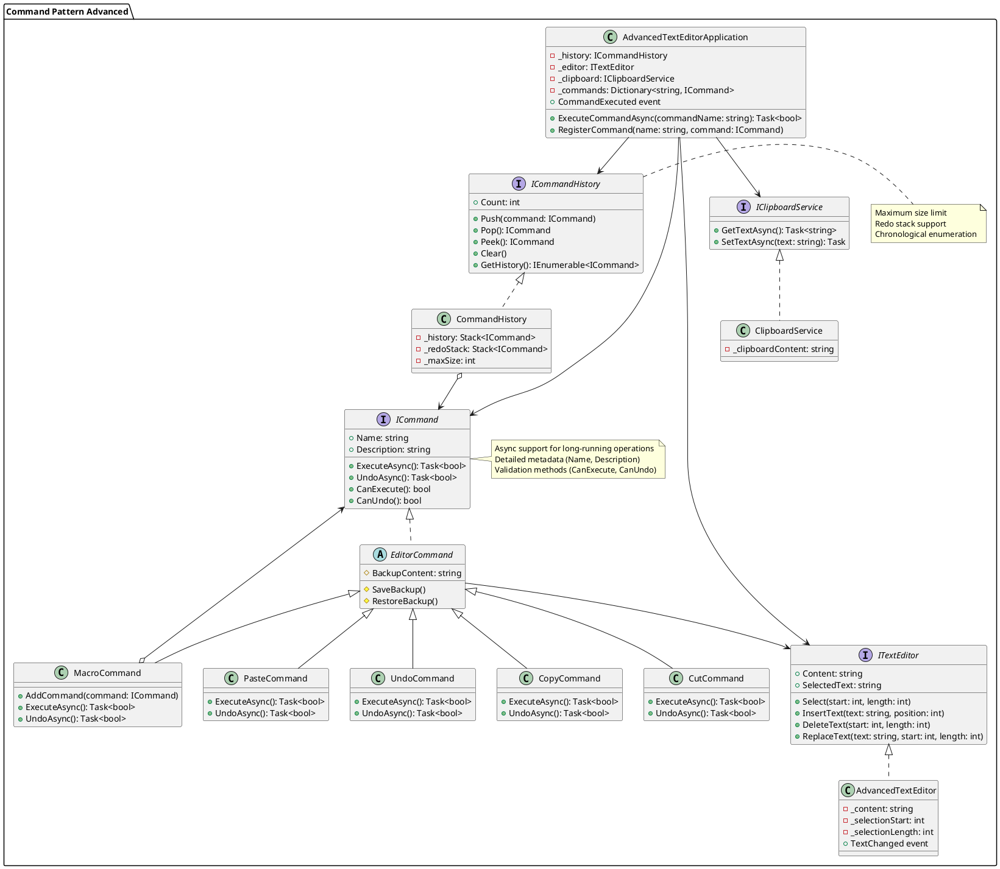

**Также известен как**: Действие, Транзакция, Action, Command

## Суть паттерна

**Команда** — это поведенческий паттерн проектирования, который превращает запросы в объекты, позволяя передавать их как аргументы при вызове методов, ставить запросы в очередь, логировать их, а также поддерживать отмену операций.


## Проблема

Представьте, что вы работаете над программой текстового редактора. Дело как раз подошло к разработке панели управления. Вы создали класс красивых `Кнопок` и хотите использовать его для всех кнопок приложения, начиная от панели управления, заканчивая простыми кнопками в диалогах.

*Все кнопки приложения унаследованы от одного класса.*
[[11d70c2d5313d28c566aa4f23054b5bd_MD5.jpeg|Open: Pasted image 20250920155316.png]]
![[11d70c2d5313d28c566aa4f23054b5bd_MD5.jpeg]]


Все эти кнопки, хоть и выглядят схоже, но делают разные вещи. Поэтому возникает вопрос: куда поместить код обработчиков кликов по этим кнопкам? Самым простым решением было бы создать подклассы для каждой кнопки и переопределить в них метод действия под разные задачи.

*Множество подклассов кнопок.*
[[0d8bbb54d68b554d38f0df88093194be_MD5.jpeg|Open: Pasted image 20250920155401.png]]
![[0d8bbb54d68b554d38f0df88093194be_MD5.jpeg]]
Но скоро стало понятно, что такой подход никуда не годится. Во-первых, получается очень много подклассов. Во-вторых, код кнопок, относящийся к графическому интерфейсу, начинает зависеть от классов бизнес-логики, которая довольно часто меняется.


*Несколько классов дублируют одну и ту же функциональность.*
[[635d9b32ac026b8771a651e9a276a5ae_MD5.jpeg|Open: Pasted image 20250920155434.png]]
![[635d9b32ac026b8771a651e9a276a5ae_MD5.jpeg]]


Но самое обидное ещё впереди. Ведь некоторые операции, например, «сохранить», можно вызывать из нескольких мест: нажав кнопку на панели управления, вызвав контекстное меню или просто нажав клавиши `Ctrl+S`. Когда в программе были только кнопки, код сохранения имелся только в подклассе `SaveButton`. Но теперь его придётся продублировать ещё в два класса.


## Решение

Хорошие программы обычно структурированы в виде слоёв. Самый распространённый пример — слои пользовательского интерфейса и бизнес-логики. Первый всего лишь рисует красивую картинку для пользователя. Но когда нужно сделать что-то важное, интерфейс «просит» слой бизнес-логики заняться этим.

В реальности это выглядит так: один из объектов интерфейса напрямую вызывает метод одного из объектов бизнес-логики, передавая в него какие-то параметры.


*Прямой доступ из UI в бизнес-логику.*
[[dfb52c607f4fb80e84bee5a3750badd1_MD5.jpeg|Open: Pasted image 20250920155540.png]]
![[dfb52c607f4fb80e84bee5a3750badd1_MD5.jpeg]]

Паттерн Команда предлагает больше не отправлять такие вызовы напрямую. Вместо этого каждый вызов, отличающийся от других, следует завернуть в собственный класс с единственным методом, который и будет осуществлять вызов. Такие объекты называют _командами_.

К объекту интерфейса можно будет привязать объект команды, который знает, кому и в каком виде следует отправлять запросы. Когда объект интерфейса будет готов передать запрос, он вызовет метод команды, а та — позаботится обо всём остальном.

*Доступ из UI в бизнес-логику через команду.*
[[e184a4d5c36fef2ccec12737abc61c48_MD5.jpeg|Open: Pasted image 20250920155610.png]]
![[e184a4d5c36fef2ccec12737abc61c48_MD5.jpeg]]

Классы команд можно объединить под общим интерфейсом c единственным методом запуска. После этого одни и те же отправители смогут работать с различными командами, не привязываясь к их классам. Даже больше: команды можно будет взаимозаменять на лету, изменяя итоговое поведение отправителей.

Параметры, с которыми должен быть вызван метод объекта получателя, можно загодя сохранить в полях объекта-команды. Благодаря этому, объекты, отправляющие запросы, могут не беспокоиться о том, чтобы собрать необходимые для получателя данные. Более того, они теперь вообще не знают, кто будет получателем запроса. Вся эта информация скрыта внутри команды.

[[d2e57c706c55a87b22352739a727cc15_MD5.jpeg|Open: Pasted image 20250920155639.png]]
![[d2e57c706c55a87b22352739a727cc15_MD5.jpeg]]
После применения Команды в нашем примере с текстовым редактором вам больше не потребуется создавать уйму подклассов кнопок под разные действия. Будет достаточно единственного класса с полем для хранения объекта команды.

Используя общий интерфейс команд, объекты кнопок будут ссылаться на объекты команд различных типов. При нажатии кнопки будут делегировать работу связанным командам, а команды — перенаправлять вызовы тем или иным объектам бизнес-логики.

Так же можно поступить и с контекстным меню, и с горячими клавишами. Они будут привязаны к тем же объектам команд, что и кнопки, избавляя классы от дублирования.

Таким образом, команды станут гибкой прослойкой между пользовательским интерфейсом и бизнес-логикой. И это лишь малая доля пользы, которую может принести паттерн Команда!


##  Структура

![[fb28e438935a03be99d5f112916ac505_MD5.jpeg]]


1. **Отправитель** хранит ссылку на объект команды и обращается к нему, когда нужно выполнить какое-то действие. Отправитель работает с командами только через их общий интерфейс. Он не знает, какую конкретно команду использует, так как получает готовый объект команды от клиента.
    
2. **Команда** описывает общий для всех конкретных команд интерфейс. Обычно здесь описан всего один метод для запуска команды.
    
3. **Конкретные команды** реализуют различные запросы, следуя общему интерфейсу команд. Обычно команда не делает всю работу самостоятельно, а лишь передаёт вызов получателю, которым является один из объектов бизнес-логики.
    
    Параметры, с которыми команда обращается к получателю, следует хранить в виде полей. В большинстве случаев объекты команд можно сделать неизменяемыми, передавая в них все необходимые параметры только через конструктор.
    
4. **Получатель** содержит бизнес-логику программы. В этой роли может выступать практически любой объект. Обычно команды перенаправляют вызовы получателям. Но иногда, чтобы упростить программу, вы можете избавиться от получателей, «слив» их код в классы команд.
    
5. **Клиент** создаёт объекты конкретных команд, передавая в них все необходимые параметры, среди которых могут быть и ссылки на объекты получателей. После этого клиент связывает объекты отправителей с созданными командами.

## Применимость

 **Когда вы хотите параметризовать объекты выполняемым действием.**

 Команда превращает операции в объекты. А объекты можно передавать, хранить и взаимозаменять внутри других объектов.

Скажем, вы разрабатываете библиотеку графического меню и хотите, чтобы пользователи могли использовать меню в разных приложениях, не меняя каждый раз код ваших классов. Применив паттерн, пользователям не придётся изменять классы меню, вместо этого они будут конфигурировать объекты меню различными командами.

 **Когда вы хотите ставить операции в очередь, выполнять их по расписанию или передавать по сети.**

 Как и любые другие объекты, команды можно сериализовать, то есть превратить в строку, чтобы потом сохранить в файл или базу данных. Затем в любой удобный момент её можно достать обратно, снова превратить в объект команды и выполнить. Таким же образом команды можно передавать по сети, логировать или выполнять на удалённом сервере.

 **Когда вам нужна операция отмены.**

 Главная вещь, которая вам нужна, чтобы иметь возможность отмены операций, — это хранение истории. Среди многих способов, которыми можно это сделать, паттерн Команда является, пожалуй, самым популярным.

История команд выглядит как стек, в который попадают все выполненные объекты команд. Каждая команда перед выполнением операции сохраняет текущее состояние объекта, с которым она будет работать. После выполнения операции копия команды попадает в стек истории, все ещё неся в себе сохранённое состояние объекта. Если потребуется отмена, программа возьмёт последнюю команду из истории и возобновит сохранённое в ней состояние.

Этот способ имеет две особенности. Во-первых, точное состояние объектов не так-то просто сохранить, ведь часть его может быть приватным. Но с этим может помочь справиться паттерн [[Снимок ()]].

Во-вторых, копии состояния могут занимать довольно много оперативной памяти. Поэтому иногда можно прибегнуть к альтернативной реализации, когда вместо восстановления старого состояния команда выполняет обратное действие. Недостаток этого способа в сложности (а иногда и невозможности) реализации обратного действия.

## Шаги реализации

1. Создайте общий интерфейс команд и определите в нём метод запуска.
    
2. Один за другим создайте классы конкретных команд. В каждом классе должно быть поле для хранения ссылки на один или несколько объектов-получателей, которым команда будет перенаправлять основную работу.
    
    Кроме этого, команда должна иметь поля для хранения параметров, которые нужны при вызове методов получателя. Значения всех этих полей команда должна получать через конструктор.
    
    И, наконец, реализуйте основной метод команды, вызывая в нём те или иные методы получателя.
    
3. Добавьте в классы отправителей поля для хранения команд. Обычно объекты-отправители принимают готовые объекты команд извне — через конструктор либо через сеттер поля команды.
    
4. Измените основной код отправителей так, чтобы они делегировали выполнение действия команде.
    
5. Порядок инициализации объектов должен выглядеть так:
    
    - Создаём объекты получателей.
    - Создаём объекты команд, связав их с получателями.
    - Создаём объекты отправителей, связав их с командами.


## Преимущества и недостатки


| Убирает прямую зависимость между объектами, вызывающими операции, и объектами, которые их непосредственно выполняют. | Усложняет код программы из-за введения множества дополнительных классов. |
| -------------------------------------------------------------------------------------------------------------------- | ------------------------------------------------------------------------ |
| Позволяет реализовать простую отмену и повтор операций.                                                              |                                                                          |
| Позволяет реализовать отложенный запуск операций.                                                                    |                                                                          |
| Позволяет собирать сложные команды из простых.                                                                       |                                                                          |
| Реализует _принцип открытости/закрытости_.                                                                           |                                                                          |


## Конкретно

**Команда** — это поведенческий паттерн, позволяющий заворачивать запросы или простые операции в отдельные объекты.

Это позволяет откладывать выполнение команд, выстраивать их в очереди, а также хранить историю и делать отмену.

**Применимость:** Паттерн можно часто встретить в C#-коде, особенно когда нужно откладывать выполнение команд, выстраивать их в очереди, а также хранить историю и делать отмену.

**Признаки применения паттерна:** Классы команд построены вокруг одного действия и имеют очень узкий контекст. Объекты команд часто подаются в обработчики событий элементов GUI. Практически любая реализация отмены использует принципа команд.


```cs
using System;

namespace Command_Conceptual
{
    // Интерфейс Команды объявляет метод для выполнения команд.
    public interface ICommand
    {
        void Execute();
    }

    // Некоторые команды способны выполнять простые операции самостоятельно.
    class SimpleCommand : ICommand
    {
        private string _payload = string.Empty;

        public SimpleCommand(string payload)
        {
            this._payload = payload;
        }

        public void Execute()
        {
            Console.WriteLine($"SimpleCommand: See, I can do simple things like printing ({this._payload})");
        }
    }

    // Но есть и команды, которые делегируют более сложные операции другим
    // объектам, называемым «получателями».
    class ComplexCommand : ICommand
    {
        private Receiver _receiver;

        // Данные о контексте, необходимые для запуска методов получателя.
        private string _a;

        private string _b;

        // Сложные команды могут принимать один или несколько объектов-
        // получателей вместе с любыми данными о контексте через конструктор.
        public ComplexCommand(Receiver receiver, string a, string b)
        {
            this._receiver = receiver;
            this._a = a;
            this._b = b;
        }

        // Команды могут делегировать выполнение любым методам получателя.
        public void Execute()
        {
            Console.WriteLine("ComplexCommand: Complex stuff should be done by a receiver object.");
            this._receiver.DoSomething(this._a);
            this._receiver.DoSomethingElse(this._b);
        }
    }

    // Классы Получателей содержат некую важную бизнес-логику. Они умеют
    // выполнять все виды операций, связанных с выполнением запроса. Фактически,
    // любой класс может выступать Получателем.
    class Receiver
    {
        public void DoSomething(string a)
        {
            Console.WriteLine($"Receiver: Working on ({a}.)");
        }

        public void DoSomethingElse(string b)
        {
            Console.WriteLine($"Receiver: Also working on ({b}.)");
        }
    }

    // Отправитель связан с одной или несколькими командами. Он отправляет
    // запрос команде.
    class Invoker
    {
        private ICommand _onStart;

        private ICommand _onFinish;

        // Инициализация команд
        public void SetOnStart(ICommand command)
        {
            this._onStart = command;
        }

        public void SetOnFinish(ICommand command)
        {
            this._onFinish = command;
        }

        // Отправитель не зависит от классов конкретных команд и получателей.
        // Отправитель передаёт запрос получателю косвенно, выполняя команду.
        public void DoSomethingImportant()
        {
            Console.WriteLine("Invoker: Does anybody want something done before I begin?");
            if (this._onStart is ICommand)
            {
                this._onStart.Execute();
            }
            
            Console.WriteLine("Invoker: ...doing something really important...");
            
            Console.WriteLine("Invoker: Does anybody want something done after I finish?");
            if (this._onFinish is ICommand)
            {
                this._onFinish.Execute();
            }
        }
    }

    class Program
    {
        static void Main(string[] args)
        {
            // Клиентский код может параметризовать отправителя любыми
            // командами.
            Invoker invoker = new Invoker();
            invoker.SetOnStart(new SimpleCommand("Say Hi!"));
            Receiver receiver = new Receiver();
            invoker.SetOnFinish(new ComplexCommand(receiver, "Send email", "Save report"));

            invoker.DoSomethingImportant();
        }
    }
}
```


```uml
@startuml AdvancedCommandPattern

package "Command Pattern Advanced" {
  interface ICommand {
    + Name: string
    + Description: string
    + ExecuteAsync(): Task<bool>
    + UndoAsync(): Task<bool>
    + CanExecute(): bool
    + CanUndo(): bool
  }

  abstract class EditorCommand {
    # BackupContent: string
    # SaveBackup()
    # RestoreBackup()
  }

  class CopyCommand {
    + ExecuteAsync(): Task<bool>
    + UndoAsync(): Task<bool>
  }

  class CutCommand {
    + ExecuteAsync(): Task<bool>
    + UndoAsync(): Task<bool>
  }

  class PasteCommand {
    + ExecuteAsync(): Task<bool>
    + UndoAsync(): Task<bool>
  }

  class UndoCommand {
    + ExecuteAsync(): Task<bool>
    + UndoAsync(): Task<bool>
  }

  class MacroCommand {
    + AddCommand(command: ICommand)
    + ExecuteAsync(): Task<bool>
    + UndoAsync(): Task<bool>
  }

  ICommand <|.. EditorCommand
  EditorCommand <|-- CopyCommand
  EditorCommand <|-- CutCommand
  EditorCommand <|-- PasteCommand
  EditorCommand <|-- UndoCommand
  EditorCommand <|-- MacroCommand

  interface ITextEditor {
    + Content: string
    + SelectedText: string
    + Select(start: int, length: int)
    + InsertText(text: string, position: int)
    + DeleteText(start: int, length: int)
    + ReplaceText(text: string, start: int, length: int)
  }

  class AdvancedTextEditor {
    - _content: string
    - _selectionStart: int
    - _selectionLength: int
    + TextChanged event
  }

  ITextEditor <|.. AdvancedTextEditor

  interface ICommandHistory {
    + Push(command: ICommand)
    + Pop(): ICommand
    + Peek(): ICommand
    + Clear()
    + Count: int
    + GetHistory(): IEnumerable<ICommand>
  }

  class CommandHistory {
    - _history: Stack<ICommand>
    - _redoStack: Stack<ICommand>
    - _maxSize: int
  }

  ICommandHistory <|.. CommandHistory

  interface IClipboardService {
    + GetTextAsync(): Task<string>
    + SetTextAsync(text: string): Task
  }

  class ClipboardService {
    - _clipboardContent: string
  }

  IClipboardService <|.. ClipboardService

  class AdvancedTextEditorApplication {
    - _history: ICommandHistory
    - _editor: ITextEditor
    - _clipboard: IClipboardService
    - _commands: Dictionary<string, ICommand>
    + CommandExecuted event
    + ExecuteCommandAsync(commandName: string): Task<bool>
    + RegisterCommand(name: string, command: ICommand)
  }

  AdvancedTextEditorApplication --> ICommandHistory
  AdvancedTextEditorApplication --> ITextEditor
  AdvancedTextEditorApplication --> IClipboardService
  AdvancedTextEditorApplication --> ICommand

  CommandHistory o--> ICommand
  EditorCommand --> ITextEditor
  MacroCommand o--> ICommand

  note right of ICommand
    Async support for long-running operations
    Detailed metadata (Name, Description)
    Validation methods (CanExecute, CanUndo)
  end note

  note right of ICommandHistory
    Maximum size limit
    Redo stack support
    Chronological enumeration
  end note

@enduml
```


```cs
using System;
using System.Collections.Generic;
using System.Linq;
using System.Threading.Tasks;

namespace CommandPattern.Advanced
{
    // ==================== INTERFACES ====================
    public interface ICommand
    {
        string Name { get; }
        string Description { get; }
        Task<bool> ExecuteAsync();
        Task<bool> UndoAsync();
        bool CanExecute();
        bool CanUndo();
    }

    public interface ICommandHistory
    {
        void Push(ICommand command);
        ICommand Pop();
        ICommand Peek();
        void Clear();
        int Count { get; }
        IEnumerable<ICommand> GetHistory();
        IEnumerable<ICommand> GetUndoableCommands();
    }

    public interface ITextEditor
    {
        string Content { get; }
        string SelectedText { get; }
        int SelectionStart { get; }
        int SelectionLength { get; }
        event EventHandler<TextChangedEventArgs> TextChanged;
        
        void Select(int start, int length);
        void InsertText(string text, int position);
        void DeleteText(int start, int length);
        void ReplaceText(string text, int start, int length);
    }

    // ==================== EVENTS ====================
    public class TextChangedEventArgs : EventArgs
    {
        public string OldText { get; }
        public string NewText { get; }
        public string ChangeType { get; }

        public TextChangedEventArgs(string oldText, string newText, string changeType)
        {
            OldText = oldText;
            NewText = newText;
            ChangeType = changeType;
        }
    }

    public class CommandExecutedEventArgs : EventArgs
    {
        public ICommand Command { get; }
        public bool Success { get; }
        public TimeSpan ExecutionTime { get; }

        public CommandExecutedEventArgs(ICommand command, bool success, TimeSpan executionTime)
        {
            Command = command;
            Success = success;
            ExecutionTime = executionTime;
        }
    }

    // ==================== CORE IMPLEMENTATIONS ====================
    public class AdvancedTextEditor : ITextEditor
    {
        private string _content = string.Empty;
        private int _selectionStart;
        private int _selectionLength;

        public string Content 
        { 
            get => _content;
            private set
            {
                if (_content != value)
                {
                    var oldText = _content;
                    _content = value;
                    TextChanged?.Invoke(this, new TextChangedEventArgs(oldText, value, "ContentChanged"));
                }
            }
        }

        public string SelectedText => 
            _selectionLength > 0 ? Content.Substring(_selectionStart, _selectionLength) : string.Empty;

        public int SelectionStart => _selectionStart;
        public int SelectionLength => _selectionLength;

        public event EventHandler<TextChangedEventArgs> TextChanged;

        public void Select(int start, int length)
        {
            _selectionStart = Math.Max(0, Math.Min(start, Content.Length));
            _selectionLength = Math.Max(0, Math.Min(length, Content.Length - _selectionStart));
        }

        public void InsertText(string text, int position)
        {
            if (string.IsNullOrEmpty(text)) return;

            position = Math.Max(0, Math.Min(position, Content.Length));
            var oldContent = Content;
            Content = Content.Insert(position, text);
            
            TextChanged?.Invoke(this, new TextChangedEventArgs(oldContent, Content, "Insert"));
        }

        public void DeleteText(int start, int length)
        {
            if (length <= 0) return;

            start = Math.Max(0, Math.Min(start, Content.Length));
            length = Math.Min(length, Content.Length - start);

            var oldContent = Content;
            Content = Content.Remove(start, length);
            
            TextChanged?.Invoke(this, new TextChangedEventArgs(oldContent, Content, "Delete"));
        }

        public void ReplaceText(string text, int start, int length)
        {
            start = Math.Max(0, Math.Min(start, Content.Length));
            length = Math.Min(length, Content.Length - start);

            var oldContent = Content;
            Content = Content.Remove(start, length).Insert(start, text);
            
            TextChanged?.Invoke(this, new TextChangedEventArgs(oldContent, Content, "Replace"));
        }
    }

    public class CommandHistory : ICommandHistory
    {
        private readonly Stack<ICommand> _history = new Stack<ICommand>();
        private readonly Stack<ICommand> _redoStack = new Stack<ICommand>();
        private readonly int _maxSize;

        public CommandHistory(int maxSize = 100)
        {
            _maxSize = maxSize;
        }

        public int Count => _history.Count;
        
        public void Push(ICommand command)
        {
            if (_history.Count >= _maxSize)
            {
                // Remove oldest command when max size reached
                var temp = new Stack<ICommand>();
                while (_history.Count > 1) // Keep at least one
                    temp.Push(_history.Pop());
                
                _history.Clear();
                while (temp.Count > 0)
                    _history.Push(temp.Pop());
            }

            _history.Push(command);
            _redoStack.Clear(); // Clear redo stack when new command is executed
        }

        public ICommand Pop()
        {
            return _history.Count > 0 ? _history.Pop() : null;
        }

        public ICommand Peek()
        {
            return _history.Count > 0 ? _history.Peek() : null;
        }

        public void Clear()
        {
            _history.Clear();
            _redoStack.Clear();
        }

        public IEnumerable<ICommand> GetHistory()
        {
            return _history.ToArray().Reverse(); // Return in chronological order
        }

        public IEnumerable<ICommand> GetUndoableCommands()
        {
            return GetHistory().Where(cmd => cmd.CanUndo());
        }
    }


    public abstract class EditorCommand : ICommand
    {
        protected readonly ITextEditor Editor;
        protected string BackupContent;
        protected int BackupSelectionStart;
        protected int BackupSelectionLength;

        public abstract string Name { get; }
        public abstract string Description { get; }

        protected EditorCommand(ITextEditor editor)
        {
            Editor = editor ?? throw new ArgumentNullException(nameof(editor));
        }

        protected virtual void SaveBackup()
        {
            BackupContent = Editor.Content;
            BackupSelectionStart = Editor.SelectionStart;
            BackupSelectionLength = Editor.SelectionLength;
        }

        protected virtual void RestoreBackup()
        {
            // This would need to be implemented with proper editor state restoration
        }

        public abstract Task<bool> ExecuteAsync();
        public abstract Task<bool> UndoAsync();

        public virtual bool CanExecute() => true;
        public virtual bool CanUndo() => !string.IsNullOrEmpty(BackupContent);
    }

    public class CopyCommand : EditorCommand
    {
        private readonly IClipboardService _clipboard;

        public override string Name => "Copy";
        public override string Description => "Copy selected text to clipboard";

        public CopyCommand(ITextEditor editor, IClipboardService clipboard) : base(editor)
        {
            _clipboard = clipboard;
        }

        public override async Task<bool> ExecuteAsync()
        {
            if (string.IsNullOrEmpty(Editor.SelectedText))
                return false;

            await _clipboard.SetTextAsync(Editor.SelectedText);
            return true;
        }

        public override Task<bool> UndoAsync() => Task.FromResult(true); // Copy cannot be undone

        public override bool CanExecute() => !string.IsNullOrEmpty(Editor.SelectedText);
        public override bool CanUndo() => false;
    }

    public class CutCommand : EditorCommand
    {
        private readonly IClipboardService _clipboard;

        public override string Name => "Cut";
        public override string Description => "Cut selected text to clipboard";

        public CutCommand(ITextEditor editor, IClipboardService clipboard) : base(editor)
        {
            _clipboard = clipboard;
        }

        public override async Task<bool> ExecuteAsync()
        {
            if (string.IsNullOrEmpty(Editor.SelectedText))
                return false;

            SaveBackup();
            await _clipboard.SetTextAsync(Editor.SelectedText);
            Editor.DeleteText(Editor.SelectionStart, Editor.SelectionLength);
            return true;
        }

        public override Task<bool> UndoAsync()
        {
            Editor.ReplaceText(BackupContent, 0, Editor.Content.Length);
            Editor.Select(BackupSelectionStart, BackupSelectionLength);
            return Task.FromResult(true);
        }
    }

    public class PasteCommand : EditorCommand
    {
        private readonly IClipboardService _clipboard;

        public override string Name => "Paste";
        public override string Description => "Paste text from clipboard";

        public PasteCommand(ITextEditor editor, IClipboardService clipboard) : base(editor)
        {
            _clipboard = clipboard;
        }

        public override async Task<bool> ExecuteAsync()
        {
            var clipboardText = await _clipboard.GetTextAsync();
            if (string.IsNullOrEmpty(clipboardText))
                return false;

            SaveBackup();
            
            if (Editor.SelectionLength > 0)
            {
                Editor.ReplaceText(clipboardText, Editor.SelectionStart, Editor.SelectionLength);
            }
            else
            {
                Editor.InsertText(clipboardText, Editor.SelectionStart);
            }
            
            return true;
        }

        public override Task<bool> UndoAsync()
        {
            Editor.ReplaceText(BackupContent, 0, Editor.Content.Length);
            Editor.Select(BackupSelectionStart, BackupSelectionLength);
            return Task.FromResult(true);
        }
    }

    public class UndoCommand : EditorCommand
    {
        private readonly ICommandHistory _history;

        public override string Name => "Undo";
        public override string Description => "Undo last command";

        public UndoCommand(ITextEditor editor, ICommandHistory history) : base(editor)
        {
            _history = history;
        }

        public override async Task<bool> ExecuteAsync()
        {
            var lastCommand = _history.Pop();
            if (lastCommand != null && lastCommand.CanUndo())
            {
                return await lastCommand.UndoAsync();
            }
            return false;
        }

        public override Task<bool> UndoAsync() => Task.FromResult(false);

        public override bool CanExecute() => _history.Count > 0;
        public override bool CanUndo() => false;
    }

    public class MacroCommand : EditorCommand
    {
        private readonly List<ICommand> _commands = new List<ICommand>();

        public override string Name => "Macro";
        public override string Description => $"Macro containing {_commands.Count} commands";

        public MacroCommand(ITextEditor editor) : base(editor) { }

        public void AddCommand(ICommand command)
        {
            _commands.Add(command);
        }

        public override async Task<bool> ExecuteAsync()
        {
            SaveBackup();
            bool success = true;

            foreach (var command in _commands)
            {
                if (!await command.ExecuteAsync())
                {
                    success = false;
                    break;
                }
            }

            return success;
        }

        public override async Task<bool> UndoAsync()
        {
            bool success = true;

            foreach (var command in _commands.Reverse<ICommand>())
            {
                if (command.CanUndo() && !await command.UndoAsync())
                {
                    success = false;
                    break;
                }
            }

            return success;
        }

        public override bool CanExecute() => _commands.All(cmd => cmd.CanExecute());
        public override bool CanUndo() => _commands.All(cmd => cmd.CanUndo());
    }
    public interface IClipboardService
    {
        Task<string> GetTextAsync();
        Task SetTextAsync(string text);
    }

    public class ClipboardService : IClipboardService
    {
        private string _clipboardContent = string.Empty;

        public Task<string> GetTextAsync() => Task.FromResult(_clipboardContent);
        public Task SetTextAsync(string text)
        {
            _clipboardContent = text ?? string.Empty;
            return Task.CompletedTask;
        }
    }


    public class AdvancedTextEditorApplication
    {
        private readonly ICommandHistory _history;
        private readonly ITextEditor _editor;
        private readonly IClipboardService _clipboard;
        private readonly Dictionary<string, ICommand> _commands;

        public event EventHandler<CommandExecutedEventArgs> CommandExecuted;

        public AdvancedTextEditorApplication()
        {
            _editor = new AdvancedTextEditor();
            _clipboard = new ClipboardService();
            _history = new CommandHistory();
            
            _commands = new Dictionary<string, ICommand>
            {
                ["copy"] = new CopyCommand(_editor, _clipboard),
                ["cut"] = new CutCommand(_editor, _clipboard),
                ["paste"] = new PasteCommand(_editor, _clipboard),
                ["undo"] = new UndoCommand(_editor, _history)
            };

            _editor.TextChanged += (s, e) => Console.WriteLine($"Text changed: {e.ChangeType}");
        }

        public async Task<bool> ExecuteCommandAsync(string commandName)
        {
            if (!_commands.ContainsKey(commandName))
                return false;

            var command = _commands[commandName];
            if (!command.CanExecute())
                return false;

            var startTime = DateTime.Now;
            var success = await command.ExecuteAsync();
            var executionTime = DateTime.Now - startTime;

            if (success && commandName != "undo" && commandName != "copy")
            {
                _history.Push(command);
            }

            CommandExecuted?.Invoke(this, new CommandExecutedEventArgs(command, success, executionTime));
            return success;
        }

        public void RegisterCommand(string name, ICommand command)
        {
            _commands[name] = command;
        }

        public ITextEditor GetEditor() => _editor;
        public ICommandHistory GetHistory() => _history;
    }


    class Program
    {
        static async Task Main(string[] args)
        {
            var app = new AdvancedTextEditorApplication();
            var editor = app.GetEditor();

            // Setup initial text and selection
            editor.InsertText("Hello, World!", 0);
            editor.Select(7, 5); // Select "World"

            Console.WriteLine($"Initial text: {editor.Content}");

            // Execute commands
            await app.ExecuteCommandAsync("copy");
            await app.ExecuteCommandAsync("cut");
            await app.ExecuteCommandAsync("paste");

            Console.WriteLine($"Final text: {editor.Content}");

            // Show command history
            var history = app.GetHistory();
            Console.WriteLine($"Command history: {history.Count} commands");
            
            foreach (var cmd in history.GetHistory())
            {
                Console.WriteLine($"- {cmd.Name}: {cmd.Description}");
            }
        }
    }
}
```


